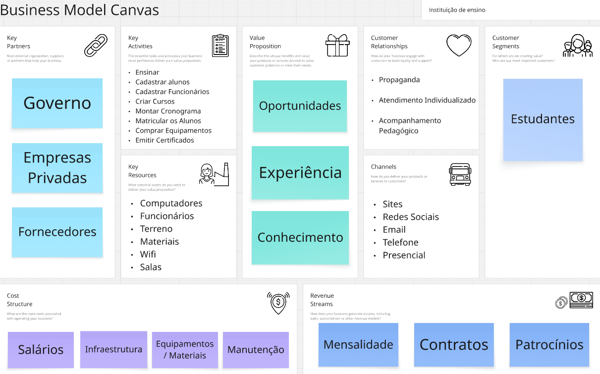

# Sistema de Gestão Escolar

## Sistema para gerenciar funcionários, alunos, cursos e matrículas

1.Que utilizará o sistema(usúarios)?
funcionários.

2.Quais os tipos de usúarios e o que cada tipo consegue fazer?
Colaboradores:cadastrar alunos, cadastrar cursos,editar dados dos alunos, editar dados dos cursos, excluir alunos, excluir cursos,
listar alunos, listar cursos, matricular alunos nos cursos e desmatricular alunos dos cursos e atualizar os proprios dados.

ADM:Todas sa fuções acima, mais: cadastrar outros fucionários, listar outros fucionarios, editar dados dos outros funcionários e excluir outros funcionários.

3.Quais informações iremos armazenar?
Funcionários:nome, email, cargo, data de nascimento, CPF, senha, telefone, endereço.

Alunos:nome, email, matricula, telefone, CPF, data de nascimento,endereco.

Cursos:descrição, carga horaria, nome.

Matriculas:quais alunos estão cadastrados em quais cursos.

4.Quais regras ou restrições são necessárias?

-Apenas funcionários ADM podem criar/deletar outros fucionários.

-Funcionários colaboradores não podem editar dados de outros 
funcionários.

-CPF não pode repetir, email não pode repetir.

-Nome, email, cargo, CPF, senha, carga horaria, matrícula são dados obrigatorios.

-Um aluno não pode ser matriculado duas ou mais vezes no mesmo curso.

-O sistema deve validar sa informações.

## PROBLEMA:
-Esses sistema é direcionado a funcionarios da escolas.
-Permite cadastrar, editar, listar e deletar alunos, cursos, matrículas e funcionários.

## Modelo de Negócio:

## Requisitos:
1. Requisitos Funcionais:
-Cadastrar Alunos
-Cadastrar Funcionários
-Cadastrar Cursos
-Listar Alunos
-Listar Cursos
-Mostrar dados dos Alunos
-Mostrar dados dos Funcionários
-Mostrar dados do Curso
-Realizar Matrículas
-Editar os dados do Aluno
-Editar os dados do Funcionário
-Excluir os Alunos
-Excluir os Funcionários
-Excluir os Cursos
-Excluir as Matrículas
-Login de usúarios
-Buscar aluno pelo nome
-Buscar aluno pelo CPF
-Buscar funcionario pelo nome
-Buscar funcionario pelo CPF
-Mostrar os cursos em que cada aluno está matriculado
-Mostrar os alunos que estão matriculados em cada curso

2. Requisitos Não Funcionais:
-Autenticação
-Interface com Navegação Padronizada a Consistente entre as Telas
-Interface responsiva e adaptativa e diversas resoluções de telas e dispositivos diferentes, como computador, celular e tablet
-Interface deve ser compatível com os principais navegadores Web
-Criptografar as senhas antes de salvá-las no banco de dados
-Disponivel durante todo o horario de funcionamento da instituição
-Restringir acesso pelo tipo de usúario

## Regras de Negócio:
-CPF de cada aluno de ser único
-CPF de cada funcionário de ser único
-Email de cada funcionario deve ser único
-A matrícula de cada aluno deve ser única
-Nome de cada curso deve ser único
-Impedir exclusão de cursos de tenham alunos matriculados
-Impedir exclusão de alunos que estejam matriculados em 1 ou mais cursos

