# Sistema de Gestão Escolar

## Sistema para gerenciar funcionários, alunos, cursos e matrículas

1.Que utilizará o sistema(usúarios)?
funcionários.

2.Quais os tipos de usúarios e o que cada tipo consegue fazer?
Colaboradores:cadastrar alunos, cadastrar cursos,editar dados dos alunos, editar dados dos cursos, excluir alunos, excluir cursos,
listar alunos, listar cursos, matricular alunos nos cursos e desmatricular alunos dos cursos e atualizar os proprios dados.

ADM:Todas sa fuções acima, mais: cadastrar outros fucionários, listar outros fucionarios, editar dados dos outros funcionários e excluir outros funcionários.

3.Quais informações iremos armazenar?
Funcionários:nome, email, cargo, data de nascimento, CPF, senha, telefone, endereço.

Alunos:nome, email, matricula, telefone, CPF, data de nascimento,endereco.

Cursos:descrição, carga horaria, nome.

Matriculas:quais alunos estão cadastrados em quais cursos.

4.Quais regras ou restrições são necessárias?

-Apenas funcionários ADM podem criar/deletar outros fucionários.

-Funcionários colaboradores não podem editar dados de outros 
funcionários.

-CPF não pode repetir, email não pode repetir.

-Nome, email, cargo, CPF, senha, carga horaria, matrícula são dados obrigatorios.

-Um aluno não pode ser matriculado duas ou mais vezes no mesmo curso.

-O sistema deve validar sa informações.

## PROBLEMA:
-Esses sistema é direcionado a funcionarios da escolas.
-Permite cadastrar, editar, listar e deletar alunos, cursos, matrículas e funcionários.

## Modelo de Negócio:

## Requisitos:
1. Requisitos Funcionais:
-Cadastrar Alunos
-Cadastrar Funcionários
-Cadastrar Cursos
-Listar Alunos
-Listar Cursos
-Mostrar dados dos Alunos
-Mostrar dados dos Funcionários
-Mostrar dados do Curso
-Realizar Matrículas
-Editar os dados do Aluno
-Editar os dados do Funcionário
-Excluir os Alunos
-Excluir os Funcionários
-Excluir os Cursos
-Excluir as Matrículas
-Login de usúarios
-Buscar aluno pelo nome
-Buscar aluno pelo CPF
-Buscar funcionario pelo nome
-Buscar funcionario pelo CPF
-Mostrar os cursos em que cada aluno está matriculado
-Mostrar os alunos que estão matriculados em cada curso

2. Requisitos Não Funcionais:
-Autenticação
-Interface com Navegação Padronizada a Consistente entre as Telas
-Interface responsiva e adaptativa e diversas resoluções de telas e dispositivos diferentes, como computador, celular e tablet
-Interface deve ser compatível com os principais navegadores Web
-Criptografar as senhas antes de salvá-las no banco de dados
-Disponivel durante todo o horario de funcionamento da instituição
-Restringir acesso pelo tipo de usúario

## Regras de Negócio:
-CPF de cada aluno de ser único
-CPF de cada funcionário de ser único
-Email de cada funcionario deve ser único
-A matrícula de cada aluno deve ser única
-Nome de cada curso deve ser único
-Impedir exclusão de cursos de tenham alunos matriculados
-Impedir exclusão de alunos que estejam matriculados em 1 ou mais cursos

## Caso de Uso:

## Classes:

Fazer o diagrama de sequência para todos os casos de uso:

- Login:
   Ator requisita o login. Se email e senha estiverem presentes, o sistema busca os dados do funcionário. Se a busca foi realizada, o banco retorna os dados do funcionário. Se a senha estiver correta, o sistema retorna o token. Se a senha estiver incorreta, o sistema retorna uma mensagem de erro. Se a busca falhou, o banco retorna erro e o sistema retorna uma mensagem de erro. Se o email ou a senha estiverem ausentes, o sistema retorna uma mensagem de erro

- Cadastrar alunos:
   Ator requisita o cadastro de aluno. Se o token for válido, se os dados obrigatórios estiverem presentes, o sistema salva os dados do aluno no banco. Se o cadastro foi realizado, o banco retorna os dados do aluno e o sistema retorna os dados do aluno. Se houve falha no cadastro, o banco retorna erro e o sistema retorna uma mensagem de erro. Se os dados obrigatórios estão ausentes, o sistema retorna uma mensagem de erro. Se o token é inválido, o sistema retorna uma mensagem de erro

- Cadastrar cursos:
   Ator requisita o cadastro de curso. Se o token for válido, se os dados obrigatórios estiverem presentes, o sistema salva os dados do curso no banco. Se o cadastro foi realizado, o banco retorna os dados do curso e o sistema retorna os dados do curso. Se houve falha no cadastro, o banco retorna erro e o sistema retorna uma mensagem de erro. Se os dados obrigatórios estão ausentes, o sistema retorna uma mensagem de erro. Se o token é inválido, o sistema retorna uma mensagem de erro

- Cadastrar funcionários:
   Ator requisita o cadastro de funcionário. Se o token for válido, se o usuário é administrador, se os dados obrigatórios estiverem presentes, o sistema salva os dados do funcionário no banco. Se o cadastro foi realizado, o banco retorna os dados do funcionário e o sistema retorna os dados do funcionário. Se houve falha no cadastro, o banco retorna erro e o sistema retorna uma mensagem de erro. Se os dados obrigatórios estão ausentes, o sistema retorna uma mensagem de erro. Se o usuário não é administrador, o sistema retorna uma mensagem de erro. Se o token é inválido, o sistema retorna uma mensagem de erro

- Listar alunos:
   Ator requisita a lista de alunos. Se o token for válido, o sistema busca os dados de todos os alunos com os cursos de cada aluno. Se a busca foi realizada, o banco retorna a lista de alunos e o sistema retorna a lista de alunos. Se houve falha na busca, o banco retorna erro e o sistema retorna uma mensagem de erro. Se o token é inválido, o sistema retorna uma mensagem de erro

- Listar cursos:
   Ator requisita a lista de cursos. Se o token for válido, o sistema busca os dados de todos os cursos com os alunos matriculados em cada curso. Se a busca foi realizada, o banco retorna a lista de cursos e o sistema retorna a lista de cursos. Se houve falha na busca, o banco retorna erro e o sistema retorna uma mensagem de erro. Se o token é inválido, o sistema retorna uma mensagem de erro

- Listar funcionários:
   Ator requisita a lista de funcionários. Se o token for válido, se o usuário é administrador, o sistema busca os dados de todos os funcionários. Se a busca foi realizada, o banco retorna a lista de funcionários e o sistema retorna a lista de funcionários. Se houve falha na busca, o banco retorna erro e o sistema retorna uma mensagem de erro. Se o usuário não é administrador, o sistema retorna uma mensagem de erro. Se o token é inválido, o sistema retorna uma mensagem de erro

- Mostrar dados de um aluno:
   Ator requisita os dados de um aluno. Se o token for válido, o sistema busca o aluno pelo id no banco com seus cursos. Se a busca foi realizada, o banco retorna os dados do aluno e o sistema retorna os dados do aluno. Se houve falha na busca, o banco retorna erro e o sistema retorna uma mensagem de erro. Se o token é inválido, o sistema retorna uma mensagem de erro

- Mostrar dados de um curso:
   Ator requisita os dados de um curso. Se o token for válido, o sistema busca o curso pelo id no banco com os alunos matriculados. Se a busca foi realizada, o banco retorna os dados do curso e o sistema retorna os dados do curso. Se houve falha na busca, o banco retorna erro e o sistema retorna uma mensagem de erro. Se o token é inválido, o sistema retorna uma mensagem de erro

- Mostrar dados de um funcionário:
   Ator requisita os dados de um funcionário. Se o token for válido, se o usuário é admin ou é o próprio funcionário, o sistema busca o funcionário pelo id no banco. Se a busca foi realizada, o banco retorna os dados do funcionário e o sistema retorna os dados do funcionário. Se houve falha na busca, o banco retorna erro e o sistema retorna uma mensagem de erro. Se o usuário não é admin e não é o próprio funcionário, o sistema retorna uma mensagem de erro. Se o token é inválido, o sistema retorna uma mensagem de erro

- Editar dados do aluno:
   Ator requisita a edição de aluno. Se o token for válido, o sistema salva os novos dados do aluno no banco. Se a atualização foi realizada, o banco retorna os novos dados do aluno e o sistema retorna os novos dados do aluno. Se houve falha na atualização, o banco retorna erro e o sistema retorna uma mensagem de erro. O sistema retorna uma mensagem de erro. Se o token é inválido, o sistema retorna uma mensagem de erro

- Editar dados do curso:
   Ator requisita a edição de curso. Se o token for válido, o sistema salva os novos dados do curso no banco. Se a atualização foi realizada, o banco retorna os novos dados do curso e o sistema retorna os novos dados do curso. Se houve falha na atualização, o banco retorna erro e o sistema retorna uma mensagem de erro. O sistema retorna uma mensagem de erro. Se o token é inválido, o sistema retorna uma mensagem de erro

- Editar dados do funcionário:
   Ator requisita a edição de funcionário. Se o token for válido, se o usuário é admin ou é o próprio funcionário, o sistema salva os novos dados do funcionário no banco. Se a atualização foi realizada, o banco retorna os novos dados do funcionário e o sistema retorna os novos dados do funcionário. Se houve falha na atualização, o banco retorna erro e o sistema retorna uma mensagem de erro. O sistema retorna uma mensagem de erro. Se o usuário não é admin e não é o próprio funcionário, o sistema retorna uma mensagem de erro. Se o token é inválido, o sistema retorna uma mensagem de erro

- Excluir aluno

- Excluir curso!

- Excluir funcionário

- Buscar aluno pelo nome

- Buscar aluno pelo CPF

- Buscar funcionário pelo nome

- Buscar funcionário pelo CPF

- Realizar matrículas

- Excluir matrículas

## Sequências:

## Cadastrar Funcionários:
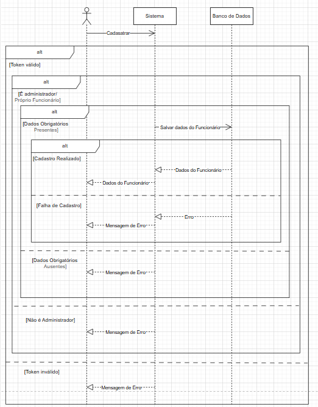

## Cadastrar Cursos:
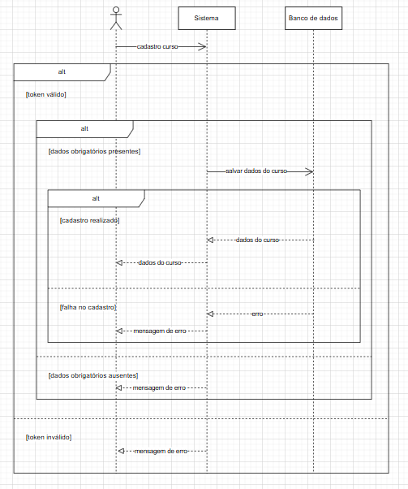

## Cadastrar Alunos:
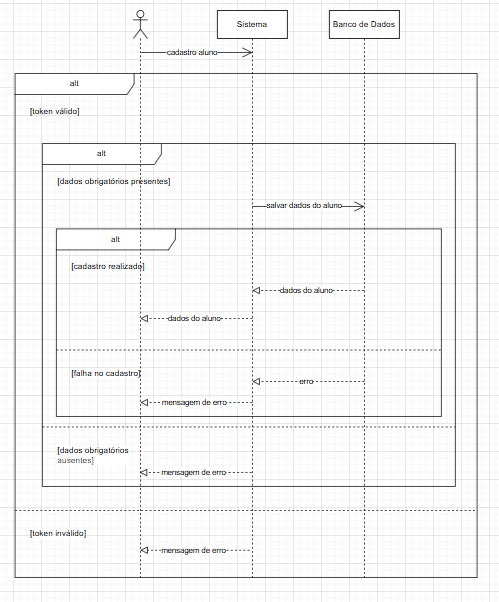

## Listar Funcionários:
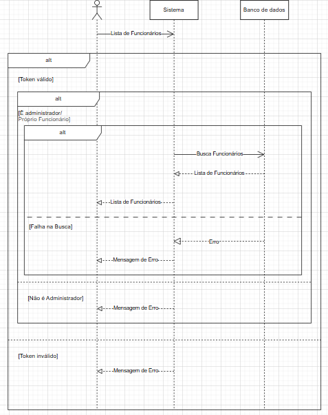

## Listar Cursos:
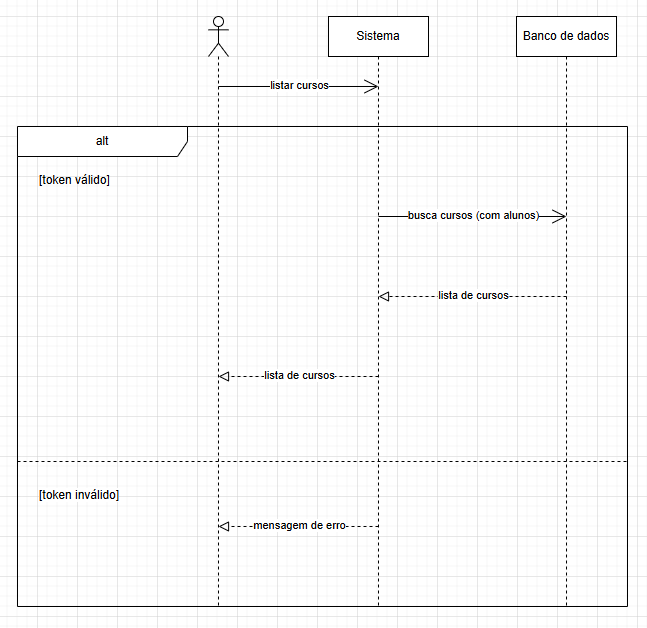

## Listar Alunos:
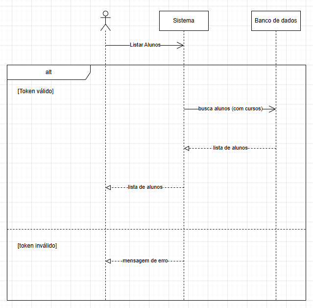

## Mostrar dados do Funcionário:
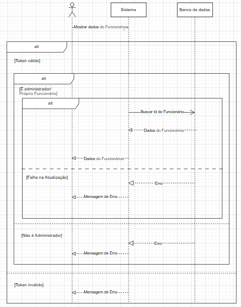

## Mostrar dados do Curso:
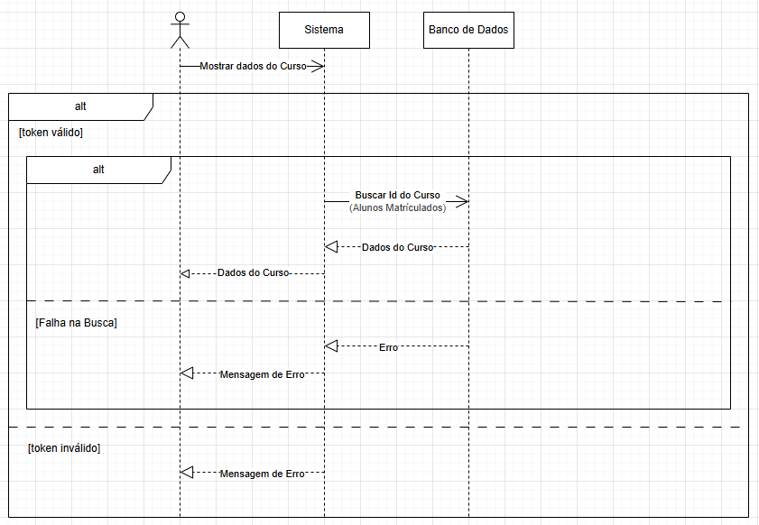

## Mostrar dados do Aluno:
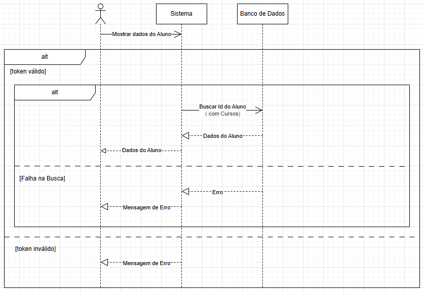

## Editar dados do Funcionário:
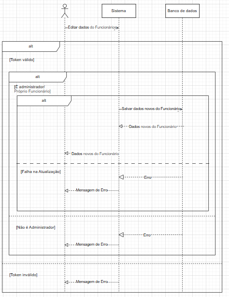

## Editar dados do Curso:
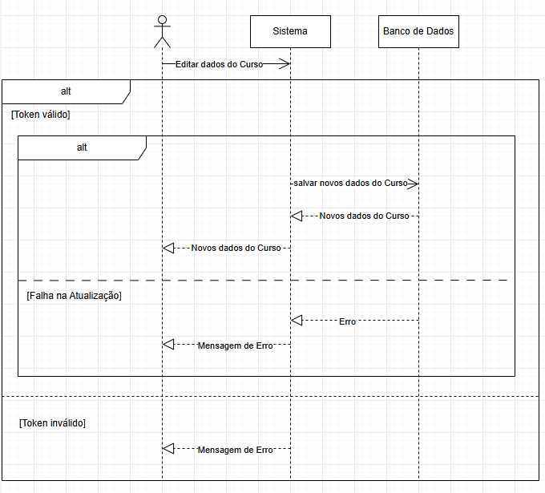

## Editar dados do Aluno:
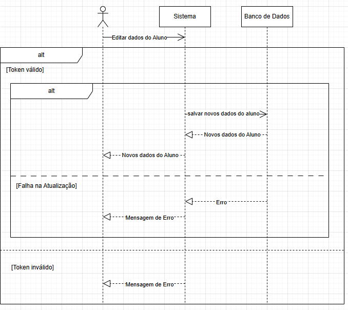

## Excluir Funcionário:
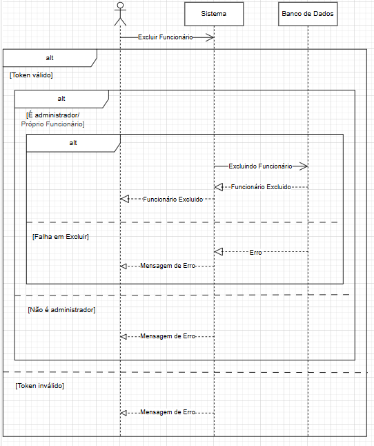

## Excluir Curso:
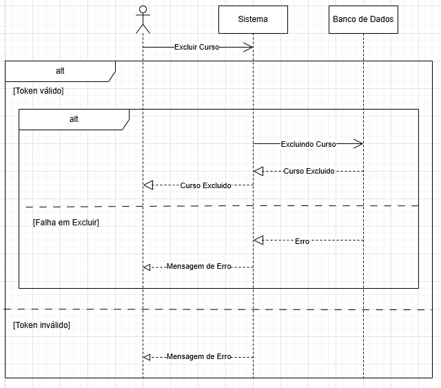

## Excluir Aluno:
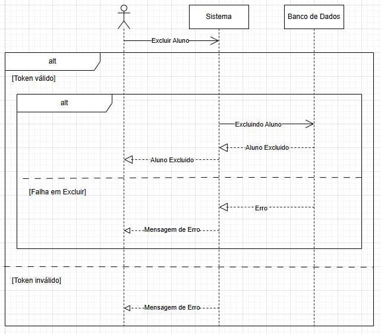

## Excluir Matrícula:
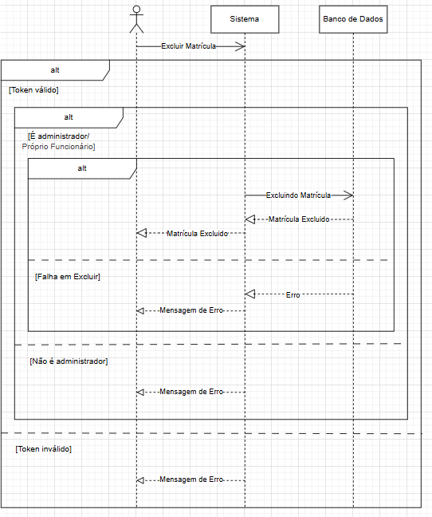

## Buscar funcionário pelo Nome:
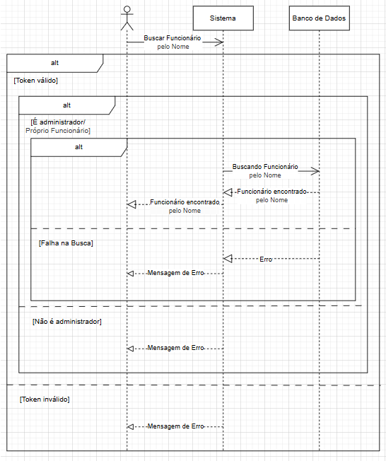

## Buscar funcionário pelo CPF:
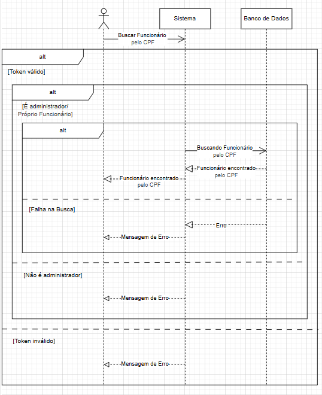

## Buscar aluno pelo Nome:
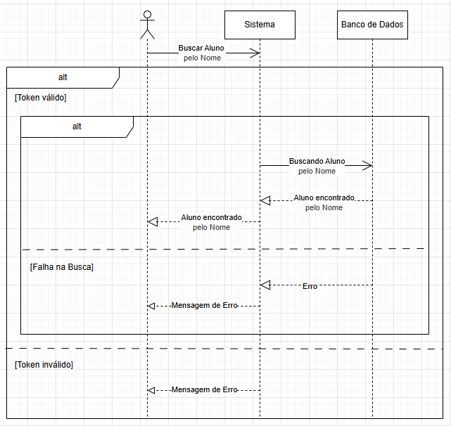

## Buscar aluno pelo CPF:
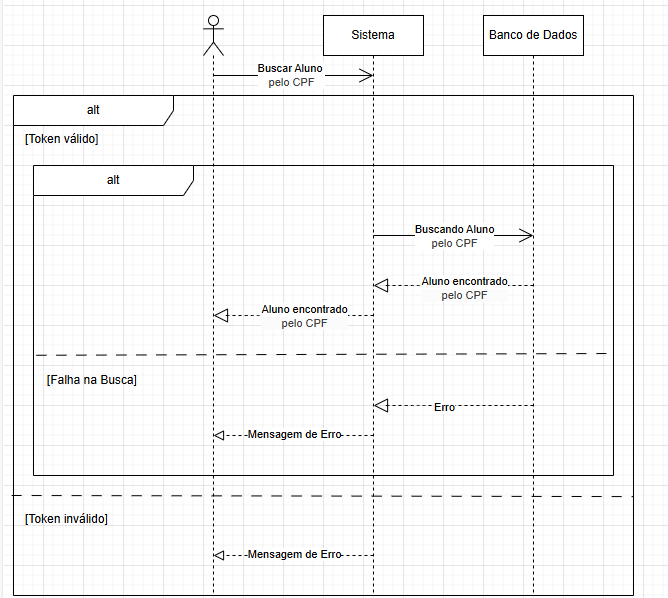

## Realizar matrículas:
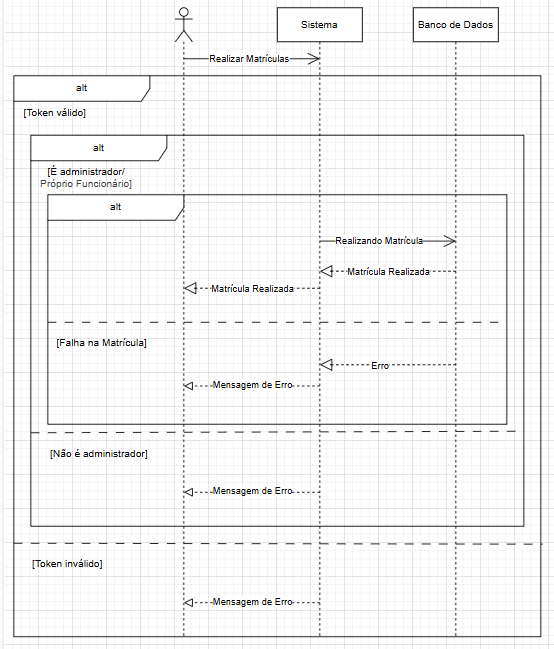